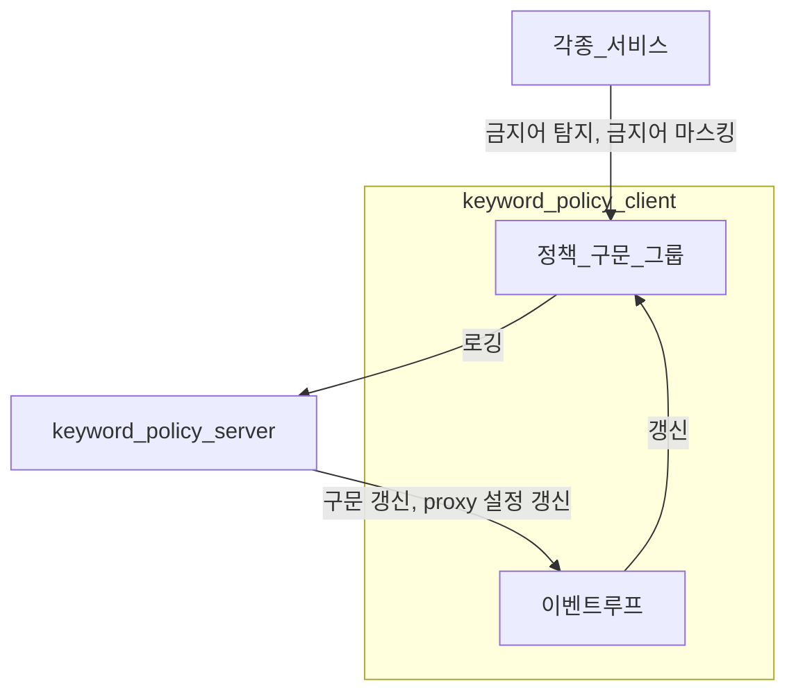

# 키워드 정책 서비스 고도화

## 배경 및 도전

키워드 정책 서비스는 회사 백엔드 주요 서비스들이 사용하는 금지어 탐지 서비스입니다.
*상품 등록*, *검색*, *채팅*, *이미지 텍스트* 등 유저가 생성할 수 있는 대부분의 텍스트 입력을 검증하기 위해 사용됩니다.

이 프로젝트를 인수인계 받아 유지보수 중에 허용어가 잘 안된다라는 문제를 제보받아 버그를 수정하는 과정에서 기존 코드는 유지보수가 어렵다 라고 판단했습니다.
또한 안전결제 100% 도입 및 수수료 인상으로 인하여 각종 금지어 우회패턴이 등장하고 있었고, 기존 시스템으로는 이를 효과적으로 대응하지 못하고 있었습니다.
이 두가지 문제를 해결하기 위하여 기존 시스템을 리팩토링하고, 기능을 추가해서 대응하고 있습니다.

## 프로젝트 개요

- 기간: 2025.12 - 2026.02 (약 2개월)
- 인원: 1명

## 주요 해결 과제

### client library

- 기존의 복잡했던 허용어 기능을 단순화
- 특정 기술에 침투적인 코드를 주요 로직과 분리(spring, rsocket)
- api 서버에서 클라이언트의 설정을 동적으로 갱신할 수 있도록 이벤트 루프 도입
- 마스킹, 금지어 검증을 각각 클래스에서 처리하던걸 목적에 맞게 분리하고 성능 최적화
- 다앙햔 목적에 맞게 api 서버에 로깅을 보낼수 있도록 개선
- 각종 변종을 대응하기 위한 텍스트 정규화 단계 추가

### api server

- client 의 설정을 원격으로 조절할 수 있도록 개선
- client 가 전송하는 로그를 받아 각종 관측 도구에 보여주도록 개선

## 아키텍쳐

아래 플로우 차트가 보이지 않으시다면 깃허브에서 봐주세요.
[link](https://github.com/jyc228/my-engineering-portfolio/blob/main/bunjang/keyword-policy.md#%EC%95%84%ED%82%A4%ED%85%8D%EC%B3%90)



## 주요 기여

### client 마스킹, 금지어 검증 기능 재구현 및 성능 최적화

기존 코드는 마스킹, 금지어 검증이라는 기능을 클래스 단위로 표현하였고, 수정한 문자열을 단일 클래스에 들고 있는 형태였습니다.

하단은 금지어 검증측 코드를 단순화 하였습니다.

```kotlin
class KeywordPreset(val lowercase: String, val uppercase: String /* 그 외 필드 4개 */)
class VerifyProcessor(val allows: List<Phrase>, val blocks: List<Phrase>) {
    fun hasBlocked(preset: KeywordPreset): Boolean {
        for (phrase in allows) {
            preset.lowercase.replace(phrase.pattern, "") // 6 필드 모두 수행 
        }

        for (phrase in blocks) {
            // preset 에서 적합한 필드 하나 선택해서 exact, contain, regex 매칭 중 하나 실행
            if (phrase.matchs(preset)) return true
        }
        return false
    }
}
```

이를 구문 성격에 따라 매칭 클래스를 나누고 통합 프로세서를 만들었습니다.

```kotlin
// 단순히 구문을 어떤 방식으로 매칭한다. 라는것을 표현합니다.
internal sealed interface PhraseMatcher {
    fun fillMatchIndex(text: CharSequence, matchedIndices: MutableMap<Int, Set<Int>>)
    fun firstMatch(text: String): PhraseMatchResult?
    fun containMatch(text: String): Boolean

    companion object {
        // hashcode를 활용하여 O(1) 연산으로 처리합니다. if (text in idByPattern)
        fun exact(idByPattern: Map<String, Int>): PhraseMatcher = ExactPhraseMatcher(idByPattern)

        // 아호코라식을 활용하여 O(n) 연산으로 처리합니다. n = text 길이
        fun contain(patternById: Map<Int, String>): PhraseMatcher = ContainPhraseMatcher(patternById)

        // 정규식 for
        fun regex(patternById: Map<Int, String>): PhraseMatcher = RegexPhraseMatcher(patternById)
    }
}

class PhrasePipeline {
    fun findBlockKeyword(text: String): PhraseMatchResult? {
        val refinedText = allow.process(text)
        for ((text, type, lang) in DerivedStringSequence(refinedText)) {
            val blockedText = block.process(allowedText, type, lang)
            if (blockedText != null) return blockedText
        }
        return null
    }
}
```

새롭게 구현된 코드들은 phrase 가 많고, text input 이 길면 길수록 기존 대비 exact, contain 에서 성능 차이를 보여줬습니다.
또한 테스트 용이성, 유지보수성 증대 등 다양한 개선사항도 포함되었습니다.

#### 벤치마크

- 맥북 m4
- exact 구문 20개, contain 구문 50개 시뮬레이션

```
exactV1    thrpt    3  37889472.663 ± 9552229.574  ops/s
exactV2    thrpt    3  95220132.204 ± 3665947.321  ops/s
containV1  thrpt    3   796130.736  ±  84858.020   ops/s
containV2  thrpt    3  3036908.411  ± 147106.356   ops/s
```

### 이벤트 기반 동적 설정 관리 시스템 구축

client 측에서 서버 푸쉬를 받는 이벤트 루프를 구축하여 서버 주도의 실시간 정책 전파 및 제어 아키텍처를 구현했습니다.

```kotlin
private val job = scope.launch {
    initJob.join() // 초기화 대기

    val channel = Channel<SignalResponse>(Channel.BUFFERED)
    launch {
        // 서버 푸쉬 메시지 구독 시작
        val request = SignalSubscriptionRequest(types, applicationName, VERSION)
        internalClient.signalFlow(request).collect { channel.send(it) }
    }

    launch {
        while (isActive) {
            // 최소 refreshInterval 마다 클라이언트의 정책을 확인 및 갱신합니다.
            val signal = withTimeoutOrNull(refreshInterval) { channel.receive() }
            val handler = handlerResolver.resolve(signal) ?: continue
            for (proxy in groupByType.values) handler(proxy)
        }
    }.invokeOnCompletion { channel.close() }
}
```

이 기능을 활용하여 다음과 같은 기능을 구현 / 구현할 예정 입니다.

- 새롭게 구현한 금지어 검증 코드를 병렬 실행 및 기존 코드와 불일치 하는 경우 서버로 보고하는 기능 (서버 제어로 병렬 실행 비율 조절 가능)
- 사용 빈도가 매우 낮은 특수문자열 탐지 및 서버 보고
- 평상시보다 금지어 탐지가 많이 될 경우, 서버로 보고
- 성능 모니터링

### 텍스트 정규화 단계 개발

안전결제 수수료 인상 이후 다음과 같은 우회 패턴들이 우후죽순 발생하고 있었습니다.

- 🦀좌 : 계좌
- ㄱㅒ좌 : 계좌
- 🍫💬 : 카카오톡

허용 -> 금지로 이뤄진 현재 상태에선 위와 같은 패턴들을 제어하기 위해선 각 변종마다 금지어 규칙을 적용해야 합니다.
이는 운영 공수가 매우 많이 들고, 많은 금지어 등록으로 인한 성능 저하가 발생할 가능성이 있다고 판단했습니다.

그래서 텍스트 정규화 단계를 추가하여 `허용 -> 정규화 -> 금지` 3단계 파이프라이닝으로 해결하려고 하고 있습니다.
핵심은 mapping 테이블을 추가하고, 한국어는 유니코드 조합을 통해 다른 텍스트로 치환만 하는것입니다.

- 🦀 -> 계
- 🍫 -> 카
- 💬 -> 톡
- ㄱㅒ -> 걔

이 기능과 함께, *사용 빈도가 낮은 문자열 탐지 및 보고 기능*이 합쳐진다면, 자체적으로 피드백 가능한 금지어 탐지 시스템이 완성되리라고 생각합니다.