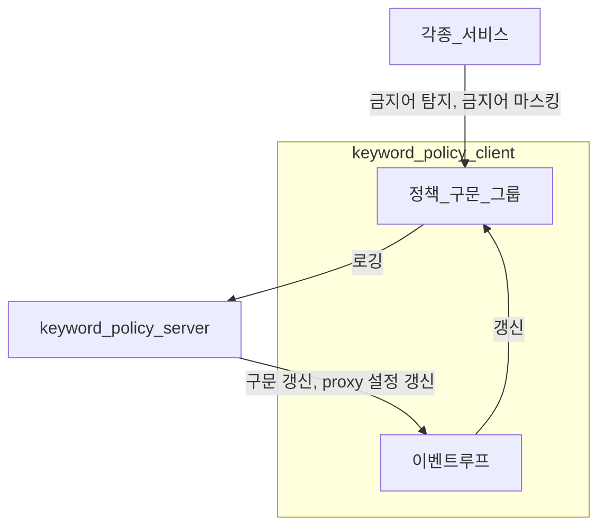

# 키워드 정책 서비스 고도화

## 프로젝트 개요

- 기간: 2025.12 - 2026.02 (약 2개월)
- 인원: 1명
- 핵심 기술: Kotlin, Kotlin Coroutine, Spring

## 핵심 요약

아호코라식 도입 및 파이프라인 재설계로 금지어 탐지 성능 2배 이상 향상, 이모지·초성 우회패턴 대응을 위한 정규화 파이프라인 설계 및 서버 주도 실시간 정책 제어 아키텍처 구현

## 배경 및 도전

키워드 정책 서비스는 상품 등록, 검색, 채팅, 이미지 텍스트 등 유저가 생성하는 대부분의 텍스트를 검증하는 핵심 서비스입니다.

인수인계 후 유지보수 중 두 가지 문제를 발견했습니다.

- 허용어 버그를 수정하는 과정에서 기존 코드 구조가 유지보수하기 어렵다고 판단
- 안전결제 수수료 인상 이후 이모지, 초성 등 각종 우회 패턴이 급증하고 있었으나 기존 시스템으로는 효과적으로 대응 불가

## 아키텍쳐

아래 플로우 차트가 보이지 않으시다면 깃허브에서 봐주세요.
[link](https://github.com/jyc228/my-engineering-portfolio/blob/main/bunjang/keyword-policy.md#%EC%95%84%ED%82%A4%ED%85%8D%EC%B3%90)


```mermaid
flowchart
    각종_서비스 -- 금지어 탐지, 금지어 마스킹 --> 정책_구문_그룹 -- 로깅 --> keyword_policy_server
    keyword_policy_server -- 구문 갱신, proxy 설정 갱신 --> 이벤트루프
    subgraph keyword_policy_client
        이벤트루프 -- 갱신 --> 정책_구문_그룹
    end
```

## 주요 기여

### 이벤트 기반 동적 설정 관리 시스템 구축

클라이언트 측에 서버 푸시를 받는 이벤트 루프를 구축하여 서버 주도의 실시간 정책 전파 및 제어 아키텍처를 구현했습니다.

`KeywordPolicyManager`에 핵심 루프 로직을 집중시키고, Spring 통합은 `KeywordPolicyClientImpl`로 분리하여 프레임워크 의존성이 비즈니스 로직에 침투하지 않도록 설계했습니다.

이 이벤트 루프를 활용하여 다음 기능을 구현하거나 설계했습니다.

- 신규 금지어 검증 코드 병렬 실행 및 기존 코드와 불일치 시 서버 보고 — **구현 완료**
- 사용 빈도 낮은 특수문자열 탐지 및 서버 보고 — **구현 완료, 적용 요청 중**
- 평상시보다 금지어 탐지 급증 시 서버 보고 — **설계 완료, 구현 예정**
- 성능 모니터링 — **설계 완료, 구현 예정**

```kotlin
private val job = scope.launch {
    initJob.join() // 초기화 대기

    val channel = Channel<SignalResponse>(Channel.BUFFERED)
    launch {
        // 서버 푸쉬 메시지 구독 시작
        val request = SignalSubscriptionRequest(types, applicationName, VERSION)
        internalClient.signalFlow(request).collect { channel.send(it) }
    }

    launch {
        while (isActive) {
            // 최소 refreshInterval 마다 클라이언트의 정책을 확인 및 갱신합니다.
            val signal = withTimeoutOrNull(refreshInterval) { channel.receive() }
            val handler = handlerResolver.resolve(signal) ?: continue
            for (proxy in groupByType.values) handler(proxy)
        }
    }.invokeOnCompletion { channel.close() }
}
```

### 금지어 탐지 파이프라인 재설계 및 성능 최적화

기존 코드는 마스킹과 금지어 검증을 기능 단위 클래스로 표현하고, 허용어 처리 시 6개 필드를 모두 순회하는 구조였습니다.
구문 수가 많고 텍스트가 길어질수록 성능이 선형으로 나빠지는 구조적 문제가 있었습니다.

이를 구문의 매칭 성격에 따라 세 가지로 분리하고, `허용 → 금지` 2단계 파이프라인으로 재설계했습니다.

- `exact`: HashMap O(1) 매칭
- `contain`: 아호코라식 O(n) 매칭 (n = 텍스트 길이)
- `regex`: 정규식 매칭

#### 벤치마크

- 환경: MacBook M4
- 조건: exact 구문 20개, contain 구문 50개

```
exactV1    thrpt    3  37,889,472  ops/s
exactV2    thrpt    3  95,220,132  ops/s  (+151%)
containV1  thrpt    3     796,130  ops/s
containV2  thrpt    3   3,036,908  ops/s  (+281%)
```

### 텍스트 정규화 파이프라인 설계

안전결제 수수료 인상 이후 아래와 같은 우회 패턴이 급증했습니다.

- `🦀좌` → 계좌
- `ㄱㅒ좌` → 계좌
- `🍫💬` → 카카오톡

기존 `허용 → 금지` 구조에서는 변종마다 금지어 규칙을 추가해야 했고, 금지어가 누적될수록 성능 저하와 운영 공수가 증가하는 구조적 문제가 있었습니다.

이를 해결하기 위해 `허용 → 정규화 → 금지` 3단계 파이프라인을 설계했습니다.
매핑 테이블을 통해 이모지와 초성을 정규 문자로 치환하면, 변종이 추가되어도 금지어 규칙 추가 없이 매핑 테이블만 갱신하면 됩니다.

사용 빈도 낮은 문자열 탐지 및 보고 기능과 결합되면, 외부 채널 피드백 없이 우회 패턴을 수집하고 매핑 테이블에 반영하는 자가 학습 구조가 완성됩니다.

> 매핑 테이블 설계 및 정규화 파이프라인 구조 설계 완료, 구현 예정