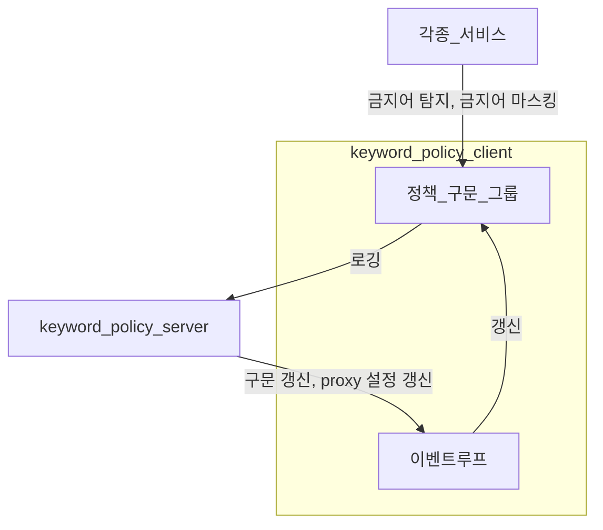

# 키워드 정책 서비스 고도화

## 프로젝트 개요

- 기간: 2025.12 - 2026.02 (약 2개월)
- 인원: 1명
- 핵심 기술: Kotlin, Kotlin Coroutine, Spring

## 핵심 요약

아호코라식 도입과 탐지 파이프라인 재구성으로 금지어 탐지 처리량 2배 이상 향상. 서버에서 클라이언트 정책을 갱신하는 이벤트 루프 구현, 이모지·초성 우회 패턴 대응용 정규화 단계 설계

## 배경 및 도전

키워드 정책 서비스는 상품 등록, 검색, 채팅, 이미지 텍스트 등 유저가 생성하는 대부분의 텍스트를 검증하는 서비스입니다.

인수인계 후 유지보수 중 두 가지 문제를 발견했습니다.

- 허용어 버그를 수정하다 보니 기존 코드 구조가 유지보수하기 어려웠음
- 안전결제 수수료 인상 이후 이모지, 초성 등 우회 패턴이 늘었는데, 기존 구조로는 변종마다 규칙을 추가하는 것 외에 방법이 없었음

## 구조

아래 플로우 차트가 보이지 않으시다면 깃허브에서 봐주세요.
[link](https://github.com/jyc228/my-engineering-portfolio/blob/main/bunjang/keyword-policy.md#%EA%B5%AC%EC%A1%B0)


```mermaid
flowchart
    각종_서비스 -- 금지어 탐지, 금지어 마스킹 --> 정책_구문_그룹 -- 로깅 --> keyword_policy_server
    keyword_policy_server -- 구문 갱신, proxy 설정 갱신 --> 이벤트루프
    subgraph keyword_policy_client
        이벤트루프 -- 갱신 --> 정책_구문_그룹
    end
```

## 주요 기여

### 서버 푸시 기반 정책 갱신

클라이언트 라이브러리에 서버 푸시를 받는 이벤트 루프를 만들어, 서버에서 정책 변경을 바로 전파할 수 있게 했습니다.

루프 로직은 `KeywordPolicyManager`에 두고, Spring 연동은 `KeywordPolicyClientImpl`로 분리해서 핵심 로직이 Spring에 의존하지 않도록 했습니다.

이 이벤트 루프 위에 다음 기능을 구현했거나 설계해 두었습니다.

- 신규 금지어 검증 코드 병렬 실행 및 기존 코드와 불일치 시 서버 보고 — **구현 완료**
- 사용 빈도 낮은 특수문자열 탐지 및 서버 보고 — **구현 완료, 적용 요청 중**
- 평상시보다 금지어 탐지 급증 시 서버 보고 — **설계 완료, 구현 예정**
- 성능 모니터링 — **설계 완료, 구현 예정**

```kotlin
private val job = scope.launch {
    initJob.join() // 초기화 대기

    val channel = Channel<SignalResponse>(Channel.BUFFERED)
    launch {
        // 서버 푸쉬 메시지 구독 시작
        val request = SignalSubscriptionRequest(types, applicationName, VERSION)
        internalClient.signalFlow(request).collect { channel.send(it) }
    }

    launch {
        while (isActive) {
            // 최소 refreshInterval 마다 클라이언트의 정책을 확인 및 갱신합니다.
            val signal = withTimeoutOrNull(refreshInterval) { channel.receive() }
            val handler = handlerResolver.resolve(signal) ?: continue
            for (proxy in groupByType.values) handler(proxy)
        }
    }.invokeOnCompletion { channel.close() }
}
```

### 금지어 탐지 파이프라인 재설계 및 성능 최적화

기존 코드는 마스킹과 금지어 검증을 기능 단위 클래스로 표현하고, 허용어 처리 시 6개 필드를 모두 순회하는 구조였습니다.
구문 수가 많고 텍스트가 길수록 성능이 선형으로 나빠졌습니다.

이를 구문의 매칭 성격에 따라 세 가지로 분리하고, `허용 → 금지` 2단계 파이프라인으로 재설계했습니다.

- `exact`: HashMap O(1) 매칭
- `contain`: 아호코라식 O(n) 매칭 (n = 텍스트 길이)
- `regex`: 정규식 매칭

#### 벤치마크

- 환경: MacBook M4
- 조건: exact 구문 20개, contain 구문 50개

```
exactV1    thrpt    3  37,889,472  ops/s
exactV2    thrpt    3  95,220,132  ops/s  (+151%)
containV1  thrpt    3     796,130  ops/s
containV2  thrpt    3   3,036,908  ops/s  (+281%)
```

### 텍스트 정규화 파이프라인 설계

안전결제 수수료 인상 이후 아래와 같은 우회 패턴이 급증했습니다.

- `🦀좌` → 계좌
- `ㄱㅒ좌` → 계좌
- `🍫💬` → 카카오톡

기존 `허용 → 금지` 구조에서는 변종마다 금지어 규칙을 추가해야 했고, 금지어가 쌓일수록 성능과 운영 공수 모두 나빠졌습니다.

이를 해결하기 위해 `허용 → 정규화 → 금지` 3단계 파이프라인을 설계했습니다.
매핑 테이블을 통해 이모지와 초성을 정규 문자로 치환하면, 변종이 추가되어도 금지어 규칙 추가 없이 매핑 테이블만 갱신하면 됩니다.

앞의 '사용 빈도 낮은 특수문자열 보고' 기능과 같이 쓰면, 외부 신고 없이도 새로운 우회 패턴을 수집해서 매핑 테이블에 반영할 수 있을 것으로 보고 있습니다.

> 매핑 테이블 설계 및 정규화 파이프라인 구조 설계 완료, 구현 예정