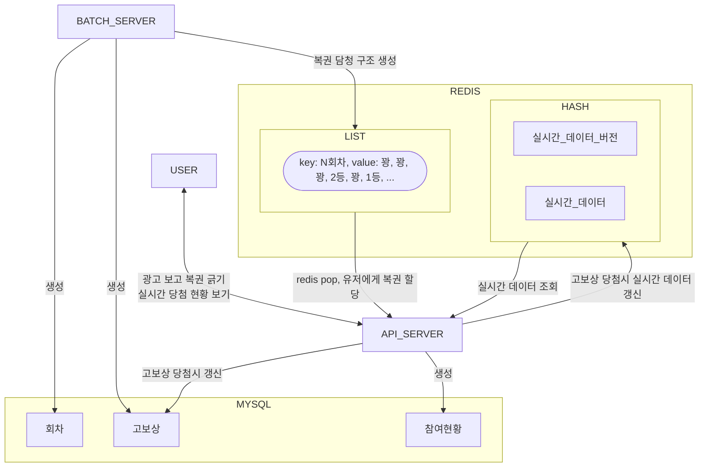

# Redis 기반 복권 당첨 처리 시스템 설계 및 구축

## 프로젝트 개요

- 기간: 2025.10 - 2025.12 (약 2개월)
- 인원: 백엔드 3명
- 핵심 기술: Kotlin, Spring Boot, Redis, MySQL
- 주요 역할: 구조 설계 및 코드 리뷰

## 주요 해결 과제

- 고 트래픽 환경에서 당첨 리워드의 중복 지급 및 초과 발급 방지
    - dau 10% - 8만 유저 시뮬레이션
    - 회차별 복권 96만개
- 실시간 당첨 현황 (1등, 2등, 3등 등등..) 제공

## 아키텍쳐

아래 플로우 차트가 보이지 않으시다면 깃허브에서 봐주세요.
[link](https://github.com/jyc228/my-engineering-portfolio/blob/main/bunjang/lottery.md#%EC%95%84%ED%82%A4%ED%85%8D%EC%B3%90)



## 주요 기여

### Redis List를 활용한 당첨 시스템 설계

당첨 여부를 API 호출 시점에 DB에서 계산하는 대신, 배치 프로세스가 미리 생성한 '당첨 슬롯'을 Redis List에 적재하고 유저는 이를 꺼내가는(LPOP) 구조를 제안 및 설계함.
이를 통해 DB 트랜잭션 없이 원자성을 보장하며, 분산 락 없이도 중복 당첨 리스크를 근본적으로 제거함.

### 재현 가능한 당첨 슬롯 생성 배치 개발

lazy 자료 구조를 사용하여 96만개를 전부 메모리에 적재하지 않고 일정 단위로 처리할 수 있도록 구현.
회차별 고유 랜덤 시드를 저장 및 사용함으로써 언제든 당첨 구조를 재현할 수 있도록 구현.

```kotlin
fun generate(random: Random): Sequence<LotteryRewardSlot> {
    // 발급 가능한 등수별 남은 개수, rewards 는 발급 가능한 보상 개수로 정렬되어 있습니다.
    val rewardCount = rewards.associate { it.rewardId to it.maxCount }.toMutableMap()
    return generateSequence(1) { it + 1 }
        .map { order ->
            val interval = rewardByInterval.entries.find { order % it.key == 0 }
            if (interval == null) {
                LotteryRewardSlot(order, selectRewardId(random, rewardCount))
            } else {  // 고정된 슬롯 보상
                LotteryRewardSlot(order, interval.value.rewardId)
            }
        }
        .take(960000)
}

private fun selectRewardId(random: Random, rewardCount: MutableMap<Long, Int>): Long {
    val index = random.nextInt(1, rewardCount.values.sum() + 1)
    var offset = 0
    for ((id, remainRewardCount) in rewardCount) { // 발급 가능한 보상 개수가 낮은 순서부터 루프 진행
        offset += remainRewardCount
        if (index <= offset) {
            rewardCount[id] = remainRewardCount - 1
            if (rewardCount[id] == 0) {
                rewardCount -= id
            }
            return id
        }
    }
    error("슬롯 생성 실패. $rewardCount")
}
```

### 다중 계층 캐싱 시스템 구축

회차 정보 및 보상 스키마 등 참조가 빈번한 데이터를 위해 Local Cache와 Redis를 조합한 다중 계층 캐시 구조를 설계하여 DB I/O를 최소화함.
스케줄러 기반의 캐시 갱신 로직을 통해 실시간 데이터 정합성을 유지함.

### 실시간 당첨 현황 관리

당첨 이벤트 발생시 레디스를 통해 버전 기반 스냅샷을 생성하여, 클라이언트가 변경분만 수신하며 현재 당첨 현황을 실시간으로 동기화할 수 있도록 지원함.
실시간 당첨 데이터의 제공은 아래와 같은 이유로 소켓 대신 http N 초 풀링으로 구현했음.

1. 실시간이 아니어도 된다. (실시간일수록 좋음)
2. 스파이크성 트래픽이 예상되기 때문에 커넥션 유지하는 방식은 피하고 싶다.

## 설계자/리뷰어로서의 역할

아키텍처 가이드: 실시간 서비스와 배치 프로세스의 역할을 명확히 분리하여 결합도를 낮추고 각 시스템의 안정성을 확보함.
품질 관리: 팀 내 3명의 백엔드 개발자 중 설계 및 전체 코드 리뷰를 주도하며, value class 활용을 통한 성능 최적화 및 도메인 복잡도 제어 등의 기술적 가이드라인 제시.