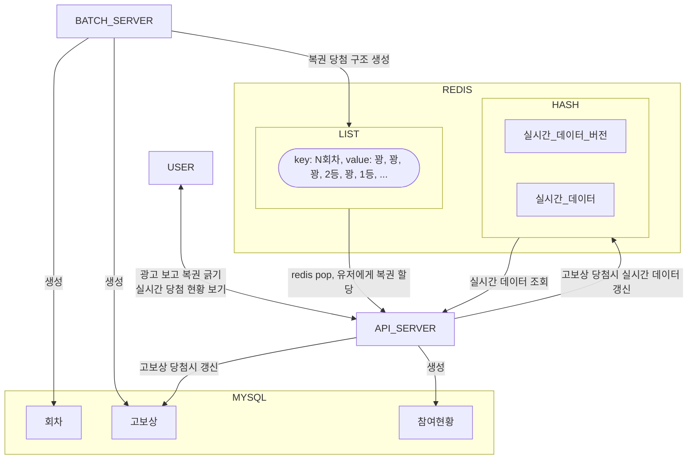

# Redis 기반 복권 당첨 처리 시스템 설계 및 구축

## 프로젝트 개요

- 기간: 2025.10 - 2025.12 (약 2개월)
- 인원: 백엔드 3명
- 핵심 기술: Kotlin, Spring Boot, Redis, MySQL
- 주요 역할: 구조 설계, 당첨 슬롯 생성 배치 구현, 코드 리뷰

## 한줄 요약

DAU 10%(8만 유저) 동시 접속을 가정해 설계. 당첨 슬롯을 미리 생성해 Redis List에서 꺼내는 방식으로 DB 트랜잭션·분산락 없이 중복 당첨 방지

## 배경 & 과제

- 고 트래픽 환경에서 당첨 리워드의 중복 지급 및 초과 발급 방지
    - DAU 10% - 8만 유저 가정
    - 회차별 복권 96만개
- 실시간 당첨 현황 (1등, 2등, 3등 등등..) 제공

## 구조

아래 플로우 차트가 보이지 않으시다면 깃허브에서 봐주세요.
[link](https://github.com/jyc228/my-engineering-portfolio/blob/main/bunjang/lottery.md#%EA%B5%AC%EC%A1%B0)


```mermaid
flowchart
    USER <-- 광고 보고 복권 긁기\n실시간 당첨 현황 보기 --> API_SERVER
    BATCH_SERVER -- 생성 --> 회차
    BATCH_SERVER -- 생성 --> 고보상
    BATCH_SERVER -- 복권 당첨 구조 생성 --> LIST
    LIST -- redis pop, 유저에게 복권 할당 --> API_SERVER
    HASH -- 실시간 데이터 조회 --> API_SERVER
    API_SERVER -- 고보상 당첨시 실시간 데이터 갱신 --> HASH
    API_SERVER -- 생성 --> 참여현황
    API_SERVER -- 고보상 당첨시 갱신 --> 고보상

    subgraph REDIS
        subgraph LIST
            N_회차([key: N회차, value: 꽝, 꽝, 꽝, 2등, 꽝, 1등, ...])
        end
        subgraph HASH
            실시간_데이터_버전
            실시간_데이터
        end
    end

    subgraph MYSQL
        회차
        고보상
        참여현황
    end
```

## 주요 기여

### Redis List를 활용한 당첨 시스템 설계

당첨 여부를 API 호출 시점에 DB에서 계산하는 대신, 배치 프로세스가 미리 생성한 '당첨 슬롯'을 Redis List에 적재하고 유저는 이를 꺼내가는(LPOP) 구조를 제안했습니다.
LPOP 자체가 원자적이기 때문에 DB 트랜잭션이나 분산 락 없이도 같은 슬롯이 두 번 지급되지 않습니다.

### 재현 가능한 당첨 슬롯 생성 배치 개발 (직접 구현)

`Sequence`를 사용해서 96만 개를 한 번에 메모리에 올리지 않고 일정 단위로 처리했습니다.
회차별 랜덤 시드를 저장해 두어서 언제든 같은 당첨 구조를 다시 만들 수 있습니다.

```kotlin
fun generate(random: Random): Sequence<LotteryRewardSlot> {
    // 발급 가능한 등수별 남은 개수, rewards 는 발급 가능한 보상 개수로 정렬되어 있습니다.
    val rewardCount = rewards.associate { it.rewardId to it.maxCount }.toMutableMap()
    return generateSequence(1) { it + 1 }
        .map { order ->
            val interval = rewardByInterval.entries.find { order % it.key == 0 }
            if (interval == null) {
                LotteryRewardSlot(order, selectRewardId(random, rewardCount))
            } else {  // 고정된 슬롯 보상
                LotteryRewardSlot(order, interval.value.rewardId)
            }
        }
        .take(960000)
}

private fun selectRewardId(random: Random, rewardCount: MutableMap<Long, Int>): Long {
    val index = random.nextInt(1, rewardCount.values.sum() + 1)
    var offset = 0
    for ((id, remainRewardCount) in rewardCount) { // 발급 가능한 보상 개수가 낮은 순서부터 루프 진행
        offset += remainRewardCount
        if (index <= offset) {
            rewardCount[id] = remainRewardCount - 1
            if (rewardCount[id] == 0) {
                rewardCount -= id
            }
            return id
        }
    }
    error("슬롯 생성 실패. $rewardCount")
}
```

### 캐시 구성

회차 정보, 보상 스키마처럼 자주 조회되는 데이터는 Local Cache와 Redis를 같이 사용해서 DB 조회를 줄였습니다.
캐시는 스케줄러로 주기적으로 갱신합니다.

### 실시간 당첨 현황 관리

당첨이 발생하면 Redis에 버전이 붙은 스냅샷을 만들고, 클라이언트는 변경된 버전만 받아가도록 했습니다.
아래 이유로 소켓 대신 HTTP N초 폴링으로 구현했습니다.

1. 실시간이 아니어도 된다. (실시간일수록 좋음)
2. 스파이크성 트래픽이 예상되기 때문에 커넥션 유지하는 방식은 피하고 싶다.

### 장애 복구 설계

Redis 장애로 List 데이터가 유실될 경우를 대비한 복구 전략을 설계했습니다.

1. **메인테인 모드 도입**: 상태 변경 API를 전면 차단
2. **DB 기준 복구 배치**: DB의 참여현황을 기준으로 미사용 복권만 계산하여 Redis List에 재적재
3. **메인테인 모드 해제**: 서비스 재개

재현 가능한 랜덤 시드를 저장해둔 덕분에 복구 시에도 동일한 당첨 구조를 재현할 수 있습니다.

> 일정상 구현은 미완성이며, 복구 시나리오와 배치 코드는 설계 완료된 상태입니다.

## 설계/리뷰 역할

- API 설계: 광고 시청을 API에 직접 묶는 대신 "티켓을 획득하고 긁는다"는 흐름으로 나누자고 제안했습니다.
  덕분에 무료 티켓, 이벤트 티켓 등 획득 방식이 늘어나도 긁기 API는 그대로 쓸 수 있습니다.
- 역할 분리: 실시간 API 서버와 배치의 역할을 나눠서 서로 영향을 덜 받도록 했습니다.
- 코드 리뷰: 백엔드 3명 중 설계와 전체 코드 리뷰를 맡았습니다.

## 결과

- 런칭 후 회차당 약 2만 명 참여, 월 매출 약 3천만 원 규모로 운영 중
- 운영 기간 중 중복 당첨 0건 (실제 트래픽은 설계 기준인 8만 명보다 적었음)
