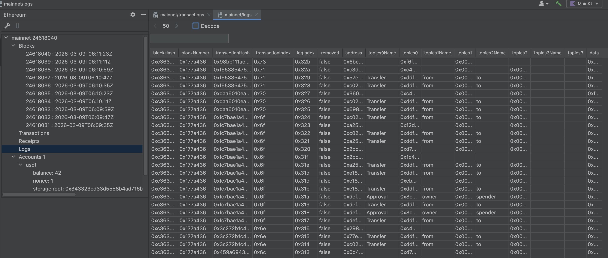
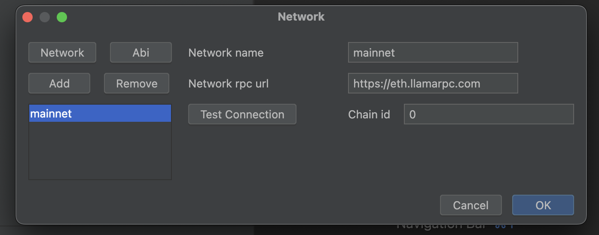
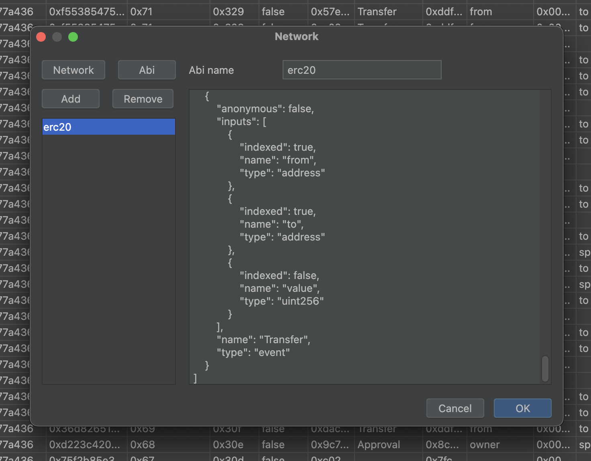

# IntelliJ Ethereum Plugin

## 한줄 요약

`keth`, `keth-client`를 기반으로 IntelliJ 안에서 블록체인 데이터를 조회할 수 있게 만든 IDE 플러그인. 탐색기는 동작하고, 디버거는 핵심 엔진까지만 구현한 상태입니다.

## 스크린샷

### 블록체인 실시간 모니터링 및 block, transaction, log 를 조회 및 검색할 수 있습니다.



### 모니터링 등 상호작용 하고 싶은 node 관리



### abi 관리, 등록하면 스마트 컨트랙트 사용 결과를 해석해서 보여줍니다.



## 배경 & 도전

이더리움 개발을 하다 보면 코드 작성(IDE), 실행(Terminal), 데이터 확인(Etherscan), 디버깅(Remix/Log)을 위해 여러 도구를 계속 오가게 됩니다.

이걸 IntelliJ 안에서 최대한 해결할 수 있으면 좋겠다고 생각해서 시작한 프로젝트입니다.

## 구성

노드(`geth`)를 띄우거나 기존 라이브러리를 쓰는 방식은 IDE 안에서 쓰기엔 무겁다고 판단해서, 아래 계층을 모두 직접 만들었습니다.

- Layer 1 - Core Engine ([keth](keth.md)): 로컬 시뮬레이션을 위해 `evm`(가상머신)과 `StateDB`를 직접 구현하여, 외부 네트워크 없이도 트랜잭션을 실행하고 되돌릴 수 있는
  환경을 마련했습니다.
- Layer 2 - Data Pipeline ([keth-client](keth-client.md)): IDE의 UI 스레드를 차단하지 않기 위해, Coroutines와 Request Batching을 활용한
  비동기 데이터 파이프라인을 구축했습니다.
- Layer 3 - User Interface (`Plugin`): IntelliJ Platform의 `VirtualFileSystem(VFS)`을 확장하여, 블록체인 데이터를 마치 로컬 파일처럼 탐색하고 에디터
  기능을 활용할 수 있게 했습니다.

## 주요 / 예정된 기능

이 플러그인은 크게 2가지 개발 목표가 있습니다.

- `IntelliJ` 의 `Database` 와 최대한 비슷하게 만들어서 추가 학습을 최소한으로 높은 사용자 경험을 주는것을 목표로 삼았습니다.
- Major language 의 디버거 플러그인과 동일한 수준의 `Solidity(스마트 컨트랙트)` 디버거를 구현하는것을 목표로 삼았습니다.

### 1. 가상 파일 시스템(VFS) 기반 블록체인 탐색기

단순히 데이터를 테이블로 보여주는 것을 넘어, 이더리움의 블록, 트랜잭션 데이터를 IntelliJ의 에디터 탭에서 파일처럼 열람할 수 있도록 `VirtualFileSystem`을 구현했습니다.

이 기능을 구현할 때 `keth-client`의 `batch`와 `interval` 기능으로 http 호출 수를 줄였습니다.
그 중 예로 `transaction` 상세를 조회하는 방법은 block에 저장된 모든 `transaction` 을 한번에 조회하거나,
`block` 과 `transaction` index 로 한개씩 조회하는 방법밖에 없습니다.
UI 응답 속도를 위해 2단계 `batch` 호출로 `transaction` 페이징을 구현했습니다.

```kotlin
// 하단 nextPage 에서 결정된 데이터로 transactions 를 조회하는 batch 요청을 보냅니다.
private fun launchUpdateUI(page: suspend () -> List<Pair<ULong, Int>>): Job = launchIO {
    val transactions = network.client.batch {
        page().map { (bn, txIndex) -> eth.getTransactionByBlockNumberAndIndex(bn, txIndex).map { it } }
    }.awaitAllOrThrow()

    invokeLater { model.initRows(transactions) }
}

// 하단 nextFlow 에서 pageSize 만큼 방출시킵니다. page size 만큼 어떤 블록의 몇번째 트랙잭션을 가져와아 하는지 알 수 있게 됩니다.
// [(10, 49), (10, 48), ..., (10, 0), (9, 29), ...]
suspend fun nextPage(): List<Pair<ULong, Int>> = nextFlow().take(pageSize).toList().updatePager()

private fun nextFlow(): Flow<Pair<ULong, Int>> = flow { // lazy stream 생성
    var blockNumberCursor = lastRow.blockNumber() ?: initBlockNumber()
    while (true) {
        val blockTxCounts = fetchBlockTxCount(blockNumberCursor - 19uL..blockNumberCursor).asReversed()
        blockTxCounts.forEach { (bn, txCount) -> // [(10, 50), (9, 30), (8, 16), ...]
            ((txCount - 1) downTo 0).forEach { txIndex -> emit(bn to txIndex) } // [(10, 49), (10, 48), (10, 47), ...]
        }
        blockNumberCursor = blockTxCounts.last().first - 1uL
    }
}

// block 에 실린 tx 개수를 http call 1번으로 조회합니다. 
private suspend fun fetchBlockTxCount(range: ULongRange) = client.batch {
    range.map { bn -> eth.getBlockTransactionCountByNumber(bn).map { bn to it.number.toInt() } }
}.awaitAllOrThrow()
```

### 2. Solidity 디버거 (예정)

스마트 컨트랙트를 로컬에서 실행하고 디버깅할 수 있도록 로컬 시뮬레이션 구조를 설계했습니다.
이를 위해 `keth` 프로젝트에서 `OffchainStateDatabase`(필요한 상태값만 메인넷에서 가져오는 가상 DB)와 확장 가능한 `EVMInterpreter를` 직접 구현했습니다.

로컬에서 트랜잭션을 재실행하고 opcode 단위로 추적하는 부분까지는 구현해서 가능성을 확인했습니다.
디버거 UI(Swing 패널)는 만들지 않은 상태로 프로젝트를 멈췄습니다.

## 최종 목표

이 플러그인을 설치하면, 아래와 같은 기능을 제공하고 싶었습니다.

- 프로젝트 내 스마트 컨트랙트 ABI 를 추출하여, `transaction` input 과, output 을 자동으로 디코딩 (지금도 미리 등록한 abi 는 가능)
- 내가 관심있는 계정 및 스마트 컨트랙트 의 변경사항 구독 (balance, nonce 는 실시간 변경 구독 가능)
- 스마트 컨트랙트 메모리 뷰어
- 스마트 컨트랙트 디버깅 (major language debugger 수준)
- 경량화된 내장 노드 제공

모두 완성되면 월 만 원 정도의 유료 구독도 생각했었습니다.

## 프로젝트 의의 및 마무리

EVM, StateDB 같은 하위 계층부터 IDE 플러그인까지 직접 만들어 본 프로젝트였습니다.

- EVM과 StateDB를 직접 구현해서 로컬에서 트랜잭션을 실행할 수 있게 했습니다.
- IDE UI가 느려지지 않도록 클라이언트 라이브러리에서 요청을 묶어 보내는 방식으로 호출 수를 줄였습니다.

디버거 UI 등 남은 작업이 있지만, 커리어 방향을 바꾸면서 현재는 중단한 상태입니다.